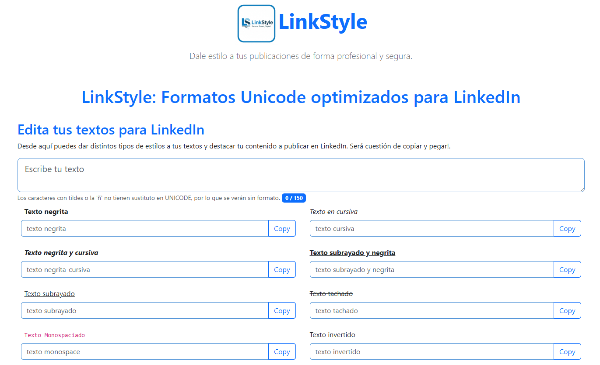

# 🚀 LinkStyle

## Formatos UNICODE optimizados para LinkedIn

<div style="text-align: center">
    
</div>

**LinkStyle** es una herramienta web ligera y segura diseñada para aplicar formatos de texto (negrita, cursiva, subrayado, monospace) en publicaciones de LinkedIn de forma profesional.

👉 **[Prueba la aplicación aquí](https://jagmolar.github.io/LinkStyle/)**

<div style="align: center">
    
</div>

Si es lo que buscabas para dar formato a tus textos en redes, también puedes trabajar con su **versión de Escritorio** que puedes ver en los archivos del repo ⬆️.
---

## 🛡️ ¿Por qué LinkStyle?

A diferencia de otras herramientas web, **LinkStyle nace de la necesidad de privacidad y transparencia**. Muchas aplicaciones similares funcionan como "cajas negras" que pueden rastrear tu actividad o gestionar de forma opaca el portapapeles.

### El manifiesto de LinkStyle:
- **100% Client-Side:** Todo el procesamiento ocurre en tu navegador. Tu texto nunca viaja a un servidor.
- **Sin rastreadores:** No hay cookies, ni analíticas, ni scripts de terceros.
- **Transparencia total:** Al ser código abierto, puedes auditar exactamente cómo se transforma tu texto.

---

## ✨ Características Principales

- **Formatos Disponibles:** Negrita, Cursiva, Negrita-Cursiva, Subrayado-Negrita, Subrayado, Monospace e Invertido.
- **Subrayado Inteligente:** Es una herramienta que respeta la anatomía de las letras. El subrayado se interrumpe en los caracteres con descendentes (`g`, `j`, `p`, `q`, `y`) para mantener una tipografía limpia y profesional.
- **Contador Real-time:** Controla el límite de caracteres con un indicador visual de proximidad.
- **Optimizado para Unicode:** Manejo correcto de caracteres de 32 bits (surrogate pairs) para evitar que los estilos se rompan al copiar.

---

## 🛠️ Tecnologías utilizadas

- **HTML5 & CSS3** (Bootstrap 5 para un diseño responsive y limpio).
- **Vanilla JavaScript:** Sin dependencias pesadas, para una carga instantánea.
- **Unicode Standard:** Uso avanzado de bloques alfanuméricos matemáticos y marcas de combinación.

---

## ♿ Nota sobre Accesibilidad

Aunque LinkStyle permite destacar visualmente tus publicaciones, recuerda que el uso de caracteres Unicode especiales puede dificultar la lectura para personas que utilizan lectores de pantalla. 

**Recomendación:** Usa estos estilos para resaltar palabras clave o títulos, no para textos excesivamente largos.

---

## 🚀 Instalación y Uso Local

Si prefieres ejecutarlo en tu propia máquina:

1. Clona el repositorio:
   ```bash
   git clone [https://github.com/JagMolar/LinkStyle.git](https://github.com/JagMolar/LinkStyle.git)
   ```
2. Abre ```index.html``` en tu navegador favorito.

---
## 🤝 Contribuciones
¡Las contribuciones son bienvenidas! Si tienes una idea para un nuevo formato o una mejora en la interfaz, siéntete libre de abrir un Issue o enviar un Pull Request.

---

## 📄 Licencia
Este proyecto está bajo la Licencia MIT. Siéntete libre de usarlo, modificarlo y compartirlo.

Creado con ❤️ por [@JagMolar](https://github.com/JagMolar)