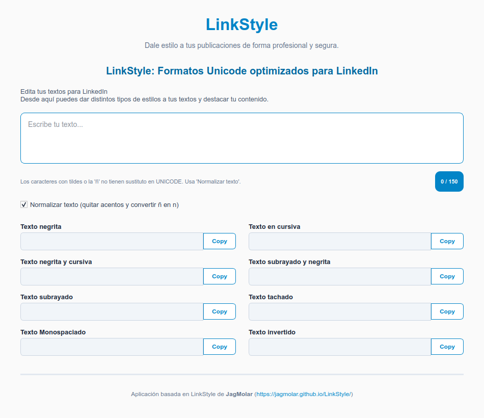

# LinkStyle Desktop 

Aplicación de escritorio desarrollada en Python y PyQt6 para generar estilos de texto con caracteres **Unicode** en tiempo real, optimizada para destacar publicaciones en LinkedIn y otras redes sociales.

Basada en la herramienta web [LinkStyle de JagMolar](https://jagmolar.github.io/LinkStyle/).



---

## Características

- **Formatos Unicode:** Convierte texto a negrita, cursiva, negrita-cursiva, monoespaciado, subrayado, tachado e invertido.
- **Normalización automática:** Elimina acentos y convierte la `ñ` en `n` para evitar rupturas de formato en Unicode.
- **Contador de caracteres:** Control dinámico con aviso visual al superar los 150 caracteres.
- **Copia rápida:** Botón interactivo para copiar el texto transformado al portapapeles con un solo clic.
- **Interfaz fluida:** Organización en 2 columnas con diseño limpio en azul celeste y soporte para scroll.

---

## Requisitos

La aplicación está desarrollada para **Python 3** y utiliza la biblioteca gráfica **PyQt6**.

En **Debian / Ubuntu** puedes instalar las dependencias con el gestor de paquetes de tu sistema:

```bash
sudo apt update
sudo apt -y install python3 python3-pyqt6
```

Opcional. Si prefieres usar un entorno virtual de Python con pip:

```bash
pip install PyQt6
```

## Ejecución desde la consola

Clona el repositorio (o entra a la carpeta donde descargaste el código):

```
git clone https://github.com/JagMolar/LinkStyle.git
cd LinkStyle
```

Ejecuta el archivo principal con Python 3:

```bash
python3 EstiloLinkendin_v2.py
```

## Licencia y Créditos

Aplicación basada en la idea original de JagMolar (LinkStyle Web).
